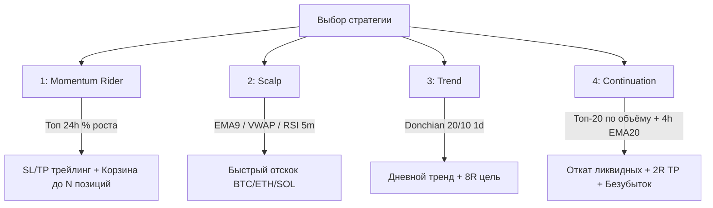

# tui-bot — Binance USDT-M Futures TestNet TUI (Rust)

Терминальный торговый бот для **USDT-M фьючерсов Binance TestNet**: интерактивный TUI-интерфейс, мониторинг счёта и позиций, график, журнал сделок, звуковые сигналы и **четыре торговые стратегии** (Momentum / Scalp / Trend / Continuation).

---

## ⚡ Быстрый старт (TL;DR)

Перед запуском убедитесь, что вы находитесь в корне репозитория и `cargo` доступен:

```bash
# 1. Просмотр интерфейса (без отправки ордеров, только мониторинг)
cargo run

# 2. Торговля на TestNet с параметрами из .env (требуются API ключи)
cargo run -- --live

# 3. Торговля конкретной стратегией (например, Стратегия 4 — Continuation)
cargo run -- --live --strategy 4

# 4. Бэктест стратегий на публичных исторических свечах (без ключей и ордеров)
cargo run -- --backtest

# 5. Сводный отчёт по закрытым сделкам, PnL, комиссиям и ошибкам
cargo run -- --report

# 6. Радар рынка: кто ждёт вход, топ роста, прибыль/убыток (ордера не шлёт)
cargo run -- --monitor --strategy 4
```

---

## 🧭 Карта проекта

| Модуль | Назначение |
| --- | --- |
| `src/engine.rs` | Движок принятия торговых решений по стратегиям (чистая логика, без сети). |
| `src/live.rs` | Исполнение ордеров TestNet: открытие позиций, TP/SL, трейлинг, авто-закрытие сиротских ордеров. |
| `src/continuation.rs` | Стратегия 4 (Continuation): откат ликвидных активов, 4h EMA20 тренд-фильтр, динамический SL/TP. |
| `src/scalp.rs` | Стратегия 2 (Scalp): откат к EMA9 / VWAP на 5м графике. |
| `src/trend.rs` | Стратегия 3 (Trend): пробой канала Дончяна (Donchian 20/10) на дневных свечах. |
| `src/ranking.rs` | Ранжирование рынка (топ 24h % роста, фильтрация неликвида и TradFi). |
| `src/tui.rs` | Цикл TUI: клавиши, отрисовка; снимок рынка (в т.ч. «Топ роста») раз в 5 сек, независимо от клавиш. |
| `src/monitor.rs` | Радар `--monitor`: ожидание входа, топ роста/падения, открытый и закрытый PnL. |
| `src/render.rs` | Форматирование экранов, расчёт цветовых акцентов (зелёный/красный PnL). |
| `src/signals.rs` | Генерация и воспроизведение звуковых сигналов (покупка, тейк-профит, стоп-лосс). |
| `src/backtest.rs` | Симуляция работы стратегий на исторических свечах klines. |
| `src/report.rs` | Генерация операторской сводки на основе файлов журналов `.state/`. |
| `src/config.rs` | Загрузка и валидация конфигурации из переменных окружения и `.env`. |
| `.state/trades.jsonl` | Журнал всех торговых событий (входы, закрытия, PnL нетто, комиссии, пропуски). |
| `.state/errors.jsonl` | Журнал предупреждений и ошибок исполнения. |

---

## 🛠 Все флаги запуска (CLI)

Все аргументы после `--` передаются непосредственно в `tui-bot`:

| Флаг | Тип | Описание |
| --- | --- | --- |
| *(без флагов)* | режим по умолчанию | Запуск интерактивного TUI в режиме просмотра (**ордера не отправляются**). |
| `--live` | флаг | Режим реальной торговли на TestNet (**требуются `BINANCE_API_KEY` и `BINANCE_API_SECRET`**). |
| `--strategy 1\|2\|3\|4` | опция | Выбор стартовой стратегии (по умолчанию `1`). |
| `--dump-frame` | флаг | Вывести в stdout один текстовый кадр интерфейса и завершить работу (код 0). |
| `--offline` | флаг | Работа без обращения к сети (рендеринг пустого снимка). |
| `--backtest` | флаг | Запуск симуляции стратегий по публичным klines свечам без отправки ордеров. |
| `--report` | флаг | Сводка по закрытым сделкам, винрейту, комиссиям и причинам отказов. |
| `--monitor` | флаг | Радар: пары в ожидании входа (с причиной), топ роста/падения, открытые позиции в плюсе/минусе, закрытия за сегодня. **Ордера не отправляются.** Можно держать рядом с `--live`. |

---

## 🚀 Примеры запуска в различных вариантах

### 1. Мониторинг и просмотр (Watch Only, без ордеров)

В этом режиме бот получает рыночные данные, рассчитывает сигналы, но **не отправляет** ордера на биржу.

```bash
# Интерактивный TUI со стратегией 1 (Momentum)
cargo run

# Сразу открыть стратегию 2 (Scalp) или стратегию 4 (Continuation)
cargo run -- --strategy 2
cargo run -- --strategy 4

# Вывести единичный снимок экрана (удобно для скриптов, логов или без TTY)
cargo run -- --dump-frame

# Полностью оффлайн-рендеринг кадра без сетевых запросов
cargo run -- --dump-frame --offline

# Радар рынка (watch-only): кто в топе роста, кто ждёт вход и почему, кто в плюсе/минусе
cargo run -- --monitor --strategy 4

# Один кадр радара в stdout (скрипты / без TTY)
cargo run -- --monitor --dump-frame --strategy 4
```

---

### Радар `--monitor`

Отдельный экран, не торговый TUI. **Никогда не шлёт ордера** и **не берёт `live.lock`**, поэтому его можно держать рядом с `cargo run -- --live`.

На кадре:

| Блок | Что видно |
| --- | --- |
| **Сводка** | стратегия, окна входа, счёт, день PnL, сколько открыто / готовы / ждут |
| **Открытые позиции** | uPnL USDT и %, SL/TP, сколько осталось до 1R, тег в плюсе / в минусе |
| **В ожидании входа** | кандидаты стратегии с причиной: сетап (откат, VWAP, 4ч EMA…), пауза, вне часов, корзина полная |
| **Топ роста / падения** | 12 растущих и 5 падающих с 24h %; тег если имя уже в позиции или в листе ожидания |
| **Закрытые сегодня** | нетто из `.state/trades.jsonl`, винрейт за UTC-день |

Клавиши: `1/2/3/4` — линза стратегии, `r` — обновить, `q` — выход. Flatten (`x`) в радаре нет.

`--monitor --live` без ключей **не отказывается**: live игнорируется, это всё равно просмотр.

---

### 2. Реальная торговля на TestNet (`--live`)

> ⚠️ Для работы `--live` необходим файл `.env` с ключами `BINANCE_API_KEY` и `BINANCE_API_SECRET`.

```bash
# Старт со Стратегией 1 (Momentum rider) с настройками из .env
cargo run -- --live

# Старт со Скальпом (Стратегия 2) — круглосуточная торговля BTC/ETH/SOL
cargo run -- --live --strategy 2

# Старт с Трендовой стратегией (Стратегия 3)
cargo run -- --live --strategy 3

# Старт со Стратегией 4 (Continuation) по окнам ликвидности UTC
cargo run -- --live --strategy 4
```

---

### 3. Запуск с переопределением параметров на лету (Environment Variables)

Параметры командной строки и переменные окружения имеют приоритет над файлом `.env`.

#### Стратегия 1 (Momentum): круглосуточно, 40 USDT на сделку, до 3-х пар
```bash
STRATEGY1_ALWAYS_ENTER=1 \
ORDER_NOTIONAL_USDT=40 \
STRATEGY1_MAX_POSITIONS=3 \
cargo run -- --live
```

#### Запуск с установкой плеча 5x на бирже:
```bash
STRATEGY1_ALWAYS_ENTER=1 \
ORDER_NOTIONAL_USDT=40 \
STRATEGY1_MAX_POSITIONS=3 \
FUTURES_LEVERAGE=5 \
cargo run -- --live
```

#### Торговля только в одну позицию:
```bash
STRATEGY1_MAX_POSITIONS=1 cargo run -- --live
```

#### Отключение звуковых эффектов:
```bash
TRADER_SIGNALS=0 cargo run -- --live
```

---

### 4. Тонкая настройка Стратегии 4 (Continuation)

Стратегия 4 считает размер входа от **процента риска**, а не от фиксированного номинала: equity = баланс кошелька + нереализованный PnL (это equity счёта, не `available_balance`). `RISK_PCT` по умолчанию 0.25% (`0.0025`): `risk_usdt = equity × RISK_PCT`, `notional = risk_usdt × entry / (entry − stop)`. Плечо в формулу не входит. Биржевой `minNotional` берётся из `exchangeInfo` (на TestNet это около 50/20/5 для BTC/ETH/SOL) — его нельзя зашивать как 100. Если после округления к фильтрам `qty × (entry − SL)` превышает `risk_usdt`, символ пропускаем: лот вверх под минимум биржи не поднимаем. `RISK_PCT=0` выключает риск-% — тогда S4 (как и остальные стратегии) снова берёт `ORDER_NOTIONAL_USDT`.

Стратегия 4 использует независимые таймфреймы, окна сессий и тренд-фильтры:

```bash
# Запуск с 15-минутными свечами (SL/TP пересчитываются под 15м: SL 2.0-5.0%, TP 2R)
STRATEGY4_INTERVAL=15m cargo run -- --live --strategy 4

# Запуск с 1-часовыми свечами (1h / 1ч)
STRATEGY4_INTERVAL=1h cargo run -- --live --strategy 4

# Ограничить входы только лондонским окном 07:00–10:00 UTC
STRATEGY4_ENTRY_HOURS=7-10 cargo run -- --live --strategy 4

# Разрешить круглосуточные входы для Стратегии 4 (24/7)
STRATEGY4_ALWAYS_ENTER=1 cargo run -- --live --strategy 4

# Комплексный запуск: 15м, корзина до 3, риск 0.25% (ORDER_NOTIONAL — запасной путь при RISK_PCT=0)
STRATEGY4_INTERVAL=15m \
STRATEGY1_MAX_POSITIONS=3 \
RISK_PCT=0.0025 \
ORDER_NOTIONAL_USDT=50 \
FUTURES_LEVERAGE=10 \
cargo run -- --live --strategy 4
```

---

### 5. Бэктест, отчёты и диагностика

```bash
# Бэктест всех 4-х стратегий на реальных исторических klines (кэшируются в .state/klines/)
cargo run -- --backtest

# Операторский отчёт по результатам торговли (PnL, комиссии, отказы, ошибки)
cargo run -- --report

# Просмотр последних записей журналов
tail -n 20 .state/trades.jsonl
tail -n 20 .state/errors.jsonl
```

---

### 6. Сборка и запуск релизного бинарника

```bash
# Компиляция оптимизированного бинарника
cargo build --release

# Прямой запуск бинарника
./target/release/tui-bot --live --strategy 4
./target/release/tui-bot --report
./target/release/tui-bot --backtest
```

---

## 📊 Четыре торговые стратегии

Переключение между стратегиями в TUI осуществляется горячими клавишами `1`, `2`, `3`, `4`. Все стратегии работают **исключительно в Long**.



---

### 1. Momentum Rider (Клавиша `1`)
Покупка лидеров суточного роста среди торгуемых USDT-M контрактов.

* **Вселенная**: Монеты с ростом за 24ч в диапазоне **+0.4% … +12%** (отсекаются TradFi-токены, пампы > +20% и монеты на самом максимуме дня).
* **Фильтры**: Текущая 5-минутная свеча должна быть зелёной; если 2 открытых слота в просадке — 3-й слот блокируется.
* **Тайминг**: Окна высокой ликвидности UTC (`00–02`, `07–10`, `13–16`) либо 24/7 при `STRATEGY1_ALWAYS_ENTER=1`.
* **Выход**: Динамический трейлинг-стоп (`TRAIL_PCT`, по умолчанию 2.0%) и тейк-профит (`TAKE_PROFIT_PCT`, по умолчанию 2.5%). При закрытии красной 5м свечи позиция сбрасывается превентивно.

---

### 2. Scalp (Клавиша `2`)
Скальпинг на откатах к скользящим средним и VWAP.

* **Вселенная**: Высоколиквидные активы (`BTCUSDT`, `ETHUSDT`, `SOLUSDT`).
* **Сигнал на вход**: `EMA9 > EMA21`, цена выше VWAP, RSI не перекуплен (< 70), подтверждённый отскок к EMA9/VWAP.
* **Таймфрейм**: 5 минут, работает круглосуточно (24/7).
* **Риск-профиль**: Стоп по ATR (с полом под комиссию), цель тейк-профита — **2R**.

---

### 3. Trend (Клавиша `3`)
Позиционная трендовая стратегия на пробой дневного диапазона Дончяна.

* **Вселенная**: `BTCUSDT`, `ETHUSDT`, `SOLUSDT`.
* **Сигнал на вход**: Закрытие дневной свечи выше 20-дневного максимума (Donchian Upper 20) при подтверждении тренда (цена > `EMA50`).
* **Таймфрейм**: Дневной (`1d`), работает круглосуточно.
* **Выход**: Закрытие ниже 10-дневного минимума (Donchian Lower 10), стоп 2 ATR, цель **8R** с ведением трейлинг-стопа.

---

### 4. Liquid Continuation (Клавиша `4`)
Трендовая стратегия продолжения движения на откатах ликвидных альткоинов.

* **Вселенная**: Топ-**20** по суточному объёму торгов (не по %, отсекаются неликвидные шиткоины с ценой < 0.5 USDT).
* **Фильтр старшего тренда (HTF)**: Закрытие **4-часовой свечи строго выше EMA20**.
* **Сетап**: Наличие **двух повышающихся минимумов (Higher Lows)**, цена выше EMA20 на рабочем ТФ, откат (красная свеча, сменившаяся закрытием зелёной в верхней половине диапазона).
* **Настраиваемый интервал (`STRATEGY4_INTERVAL`)**:
  * `5m`: SL 1.5%–3.5%, TP 2R (~3%–7%)
  * `15m` (рекомендуется): SL 2.0%–5.0%, TP 2R (~4%–10%)
  * `30m`: SL 2.5%–6.0%, TP 2R (~5%–12%)
  * `1h`: SL 3.0%–8.0%, TP 2R (~6%–16%)
* **Управление позицией**:
  * При достижении **+1R** фиксируется ~50% лонга, стоп остатка переносится в **безубыток** (+покрытие комиссии). Если лот нельзя делить — только безубыток.
  * Трейлинг ведётся **по локальным минимумам (Swing Lows)** свечей выбранного ТФ.
  * При срабатывании стоп-лосса накладывается **12-часовой кулдаун** на повторный вход по этой монете.

---

## ⚙️ Конфигурация и файл `.env`

Конфигурационный файл `.env` должен находиться в корневой директории проекта:

```bash
# Установка безопасных прав доступа (только для владельца)
chmod 600 .env
```

### Полный перечень параметров

| Переменная | Значение по умолчанию | Описание |
| --- | --- | --- |
| **Ключи и API** | | |
| `BINANCE_API_KEY` | — | Публичный API-ключ Binance Futures TestNet (≥ 16 символов). |
| `BINANCE_API_SECRET` | — | Секретный ключ API Binance TestNet (≥ 16 символов). |
| `BINANCE_FAPI_BASE` | `https://testnet.binancefuture.com` | Базовый URL фьючерсного REST API Binance. |
| `BINANCE_ALLOW_MAINNET` | `0` | Защитный флаг (`1`/`true` для разрешения боевого MainNet API). |
| `BINANCE_RECV_WINDOW` | `5000` | Окно валидности подписи запросов (в миллисекундах, 100–60000). |
| `HTTP_TIMEOUT` | `10` | Таймаут HTTP-запросов в секундах (1–60). |
| **Управление рисками и ордерами** | | |
| `ORDER_NOTIONAL_USDT` | `20` | Номинал позиции в USDT на один вход (либо `binance` для мин. лота). Для S4 это запасной путь, когда `RISK_PCT=0`. |
| `RISK_PCT` | `0.0025` | Доля equity (кошелёк + uPnL) на один вход S4. `0` — выкл., тогда S4 берёт `ORDER_NOTIONAL_USDT`. Не раздуваем лот под minNotional. |
| `FUTURES_LEVERAGE` | `binance` (не задано) | Плечо на бирже (`1`–`125`). Если не задано — не меняет плечо на аккаунте. |
| `DAILY_LOSS_USDT` | `20` | Максимальный дневной убыток в USDT до блокировки новых входов. |
| `DAILY_LOSS_R` | `3` | Дневной стоп в R (1R = day_start_equity × RISK_PCT); срабатывает **или** USDT-лимит, **или** R-лимит. `0` / `RISK_PCT=0` — только USDT. |
| `BINANCE_STARTING_EQUITY`| Первый баланс | Якорный баланс для расчёта графы «Прибыль счета». |
| **Стратегия 1 (Momentum)** | | |
| `STRATEGY1_ALWAYS_ENTER`| `0` | `1` — разрешить входы 24/7 (игнорировать окна UTC). |
| `STRATEGY1_ENTRY_HOURS` | `0-2,7-10,13-16` | Торговые окна UTC (`0-2` Азия, `7-10` Лондон, `13-16` Нью-Йорк). |
| `STRATEGY1_POLL_SECONDS`| `60` | Интервал сканирования рынка (`60` или `120` сек). |
| `STRATEGY1_MAX_POSITIONS`| `1` | Максимальное число одновременно открытых разных позиций (`1`–`10`). |
| `TAKE_PROFIT_PCT` | `0.025` | Базовый тейк-профит (+2.5%). |
| `TRAIL_PCT` | `0.020` | Шаг трейлинг-стопа (2.0%). |
| **Стратегия 4 (Continuation)** | | |
| `STRATEGY4_INTERVAL` | `5m` | Рабочий таймфрейм свечей (`5m`, `15m`, `30m`, `1h` или `5м`/`15м`/`1ч`). |
| `STRATEGY4_ALWAYS_ENTER`| `0` | `1` — разрешить входы 24/7 независимо от Стратегии 1. |
| `STRATEGY4_ENTRY_HOURS` | `0-2,7-10,13-16` | Торговые окна UTC для стратегии Continuation. |
| `STRATEGY4_MAX_POSITIONS` | `5` | Максимум одновременных лонгов Continuation (`1`–`10`). |
| **Интерфейс и сигналы** | | |
| `TRADER_SIGNALS` | `1` в TUI | `1` — включить звук, `0` — без звуков. |

---

### Пример готового файла `.env`

```ini
# API ключи Binance TestNet
BINANCE_API_KEY=your_testnet_api_key_here
BINANCE_API_SECRET=your_testnet_api_secret_here
BINANCE_FAPI_BASE=https://testnet.binancefuture.com
BINANCE_ALLOW_MAINNET=0

# Размер позиций и плечо
ORDER_NOTIONAL_USDT=40
FUTURES_LEVERAGE=5
STRATEGY1_MAX_POSITIONS=3
DAILY_LOSS_USDT=20
DAILY_LOSS_R=3

# Стратегия 1 (Momentum)
STRATEGY1_ALWAYS_ENTER=1
STRATEGY1_POLL_SECONDS=60
TAKE_PROFIT_PCT=0.025
TRAIL_PCT=0.020

# Стратегия 4 (Continuation)
STRATEGY4_INTERVAL=15m
STRATEGY4_ALWAYS_ENTER=0
STRATEGY4_ENTRY_HOURS=0-2,7-10,13-16

# Звуковые сигналы (1 - вкл, 0 - выкл)
TRADER_SIGNALS=1
```

---

## 🛡 Безопасность исполнения и защита депозита

* **Reduce-Only ордера**: Все защитные TP и SL ордера выставляются со строгим флагом `reduceOnly` на точный объем открытой позиции, что исключает случайное открытие противоположной короткой позиции при срабатывании стопа.
* **Orphan Protection (Очистка сиротских стопов)**: При закрытии лонга бот автоматически находит и отменяет оставшиеся защитные заявки на бирже.
* **Naked Fill / Short Sweep**: Если на аккаунте обнаруживается шорт или позиция без выставленного стопа (например, после ручных действий на бирже или аварийного рестарта), бот мгновенно закрывает её по рынку.
* **Умные кулдауны**: После закрытия позиции по стопу бот блокирует повторные входы по этой же монете (в Стратегии 4 — на **12 часов**).
* **Учёт комиссий**: В расчет заложена комиссия **taker 0.04% за сторону** (суммарно ~0.08% за круг). Тейк-профиты рассчитываются с запасом, чтобы чистый результат после комиссии оставался строго положительным.

---

## 🔊 Звуковые сигналы (Audio Signals)

В интерактивном TUI бот воспроизводит различимые звуковые аккорды для ключевых событий:

| Событие | Сигнал | Аудио-рисунок |
| --- | --- | --- |
| **Вход в позицию (Buy)** | 2 высоких тона | `880 Гц` → `1175 Гц` |
| **Прибыльный выход (Take-Profit / Win)** | 3 восходящих тона | `784 Гц` → `988 Гц` → `1318 Гц` |
| **Убыточный выход (Stop-Loss / Flatten)** | 3 нисходящих тона | `392 Гц` → `311 Гц` → `246 Гц` |
| **Удержание / Сдвиг трейлинга** | Тишина | — |

*На macOS воспроизведение работает нативно через `afplay` с генерацией WAV в памяти.*

---

## ⌨️ Управление в TUI

| Клавиша | Действие |
| --- | --- |
| `1`, `2`, `3`, `4` | Мгновенное переключение активной стратегии на экране. |
| `r` | Принудительное обновление снимка стакана, снятие блокировки после аварийного закрытия и сброс ошибки. |
| `x` затем `x` | **Экстренное закрытие всех позиций (Emergency Flatten)** — требует двойного нажатия `x`. Любая другая клавиша отменяет действие. |
| `q` или `Esc` | Корректный выход из бота. |

---

## 📈 Структура экрана TUI

```text
┌─ tui-bot: Binance USDT-M Futures TestNet ────────────────────────────────┐
│ Баланс: 3,124.50 USDT   Прибыль счета: +124.50 USDT   Плечо: 5x         │
│ Активные позиции: 2 / 3   Дневной стоп: 20 USDT (остаток: 18.20 USDT)    │
├──────────────────────────────────────────────────────────────────────────┤
│ Символ   | Размер | Вход     | Маркировка | PnL (USDT) | TP       | SL   │
│ BTCUSDT  | 0.002  | 64,200.0 | 64,850.0   | +1.30 (+1%)| 65,800.0 | BE   │
│ SOLUSDT  | 0.800  | 142.10   | 144.50     | +1.92 (+2%)| 149.20   | Трейл│
├──────────────────────────────────────────────────────────────────────────┤
│ Стратегия: 4 (Continuation 15m) | Сессия: Лондон (до 10:00 UTC)          │
│ Фильтр HTF: 4h EMA20 Bullish | Топ ликвидности: 20 монет                 │
│ Последнее действие: SOLUSDT SL перенесен в безубыток (+1R)               │
└──────────────────────────────────────────────────────────────────────────┘
```

---

## 🧪 Тестирование и проверка

```bash
# Запуск всех модульных и интеграционных тестов
cargo test

# Запуск тестов без обращения к сети
cargo test --offline
```
